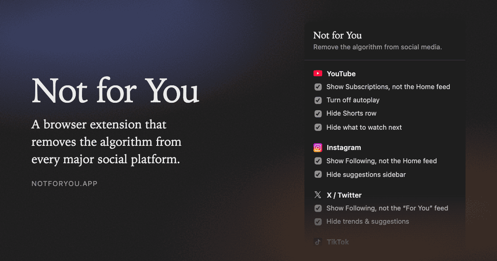

# Not for You

A browser extension that removes the algorithm from every major social platform.
No suggested posts, no recommended accounts, no "people you may know." Just the
accounts you chose to follow, in the order they posted.

[notforyou.app](https://notforyou.app)



## What it changes

Every option below is a checkbox in the popup, on by default (except where
noted), and can be turned off per platform.

| Platform  | Feed                                    | Extra options                                                     |
| --------- | --------------------------------------- | ----------------------------------------------------------------- |
| YouTube   | Subscriptions instead of the Home feed  | turn off autoplay, hide the Shorts row, hide "what to watch next" |
| Instagram | Following instead of the Home feed      | hide the suggestions sidebar                                      |
| TikTok    | Following instead of the "For You" feed | hide the header bar                                               |
| X/Twitter | Following instead of the "For You" feed | hide trends and suggestions                                       |
| Reddit    | left alone, it is already followed-only | hide promoted posts and ads, hide recommendations, use old Reddit (off by default) |
| LinkedIn  | Recent instead of the Top sort          | hide promoted and suggested posts, hide the news sidebar          |
| Threads   | Following instead of the "For You" feed |                                                                   |
| Facebook  | The Feeds view instead of Home          | hide the Reels tab                                                |

Nothing else changes. Search, profiles, messages and posting all work exactly as
before, and a button in the popup turns the whole thing off for a few minutes
when you want the algorithm back.

## Install

[Chrome Web Store](https://chromewebstore.google.com/detail/not-for-you/pakdneaipkfgaahgbafblmdebfoadjca)
(Chrome, Edge, Brave, Opera, Arc and the other Chromium browsers)

[Firefox Add-ons](https://addons.mozilla.org/firefox/addon/notforyou/)

To run it from source instead:

```sh
npm install
npm run build
```

Then open `chrome://extensions`, turn on Developer mode, choose "Load unpacked"
and pick `.output/chrome-mv3`.

For a Firefox build of your own, `npm run build:firefox` and load
`.output/firefox-mv3` as a temporary add-on from `about:debugging`.

## How it works

Two mechanisms, and the first is always preferred:

1. **URL redirect.** Where a platform has a real chronological route, the
   extension sends you there with a `declarativeNetRequest` rule: YouTube to
   `/feed/subscriptions`, Instagram to `?variant=following`, Threads and TikTok
   to `/following`, Facebook to its `Feeds` view, and Reddit to `old.reddit.com`
   if you ask for it. Durable, and it degrades gracefully.
2. **DOM work.** Only where no such route exists (X keeps snapping back to "For
   You"; LinkedIn buries its Recent sort in a dropdown) or to hide the leftover
   recommendation blocks that no URL avoids. This part is matched against the
   platforms' current markup and will break when they change it.

Redirects that a single-page app performs internally never hit the network, so
`lib/spa.ts` catches those in the content script as a fallback.

## Possible additions

Platforms worth supporting, roughly in the order they make sense to build.

| Platform  | Why                                                                                 |
| --------- | ----------------------------------------------------------------------------------- |
| Twitch    | Home is pure recommendations, and `/directory/following/live` is a clean redirect.   |
| Bluesky   | The closest fit to the premise, but Following is client state, so DOM work like X.   |
| Substack  | The Notes home feed is algorithmic; `/inbox` is just what you subscribed to.         |
| Pinterest | The most algorithmic feed of the lot. Its Following view keeps coming and going.     |
| Medium    | `/following` is chronological, the home feed is not.                                 |
| Tumblr    | The dashboard grew a "For you" tab. Unclear whether Following is URL-addressable.    |
| GitHub    | The dashboard feed has For you and Following tabs. Small audience, tiny fix.         |

## Privacy

No accounts, no servers, no analytics, and the extension makes no network
requests of its own. The only thing stored is which platforms are enabled and
their options, in the browser's own extension storage. Full policy:
[notforyou.app/privacy](https://notforyou.app/privacy).

## Development

Built with [WXT](https://wxt.dev) and TypeScript, Manifest V3 on every browser.

```sh
npm run dev         # load into Chrome with hot reload
npm run dev:firefox # the same in Firefox
npm run compile     # typecheck
npm run zip         # package for the Chrome Web Store
npm run zip:firefox # package for Firefox Add-ons
```

| Path               | What lives there                                                    |
| ------------------ | ------------------------------------------------------------------- |
| `lib/platforms.ts` | Every platform: labels, match patterns, redirect rules. Start here. |
| `entrypoints/`     | The background script, one content script per platform, the popup.  |
| `lib/settings.ts`  | Stored settings and the temporary-disable timer.                    |
| `site/public/`     | The landing page and privacy policy, deployed to notforyou.app.     |
| `site/pages/`      | Template and copy the per-platform pages are generated from.        |
| `site/main.tf`     | Terraform for the site's S3 and CloudFront setup.                   |

`lib/platforms.ts` is the single source of truth: content scripts take their
match patterns from it via `matchesFor()`, and `wxt.config.ts` builds
`host_permissions` from the same list, so the two cannot drift apart.

The social card at `site/public/og.png` is generated from `site/og-image.html`.
Regenerating it after an edit is a headless screenshot; the command is in a
comment at the top of that file.

## The site

```sh
npm run dev:site    # preview site/public at http://127.0.0.1:8080
npm run build:pages # regenerate the per-platform pages into site/public
npm run build:site  # minified copy of site/public into site/.build
```

`site/public` is the source of truth and what you edit, with two exceptions.
The per-platform pages (`twitter.html`, `youtube.html` and the rest) are
generated: their copy lives in `site/pages/platforms.mjs`, their shell in
`site/pages/template.html`, and the shared theme, hero and install regions are
lifted out of `index.html` itself, so edit those and re-run `build:pages`
rather than the output. `site/.build` is likewise generated, by `build:site`,
which strips comments and minifies the inline CSS and JS for deployment.

Use `npm run dev:site` rather than any other static server. Every internal link
is extensionless (`/youtube`, not `/youtube.html`), which works in production
only because the CloudFront function in `site/url-rewrite.js` appends `.html`
at the edge; `scripts/serve-site.mjs` applies the same rule locally, so a plain
`python -m http.server` will 404 on every page but the homepage. Pass a port
and a directory to preview something else, for example
`node scripts/serve-site.mjs 8081 site/.build` to check the minified output.

## Contributing

Platforms change their markup constantly, so the most useful thing you can file
is a broken selector: which platform, which option, and what you see instead.
[Open an issue](https://github.com/preziotte/not-for-you/issues). Anything
security-sensitive goes to email instead: see [SECURITY.md](SECURITY.md).

Releases are cut by tag. Bump the version in `package.json`, write the
`CHANGELOG.md` entry, then push a matching `v1.2.3` tag: the release workflow
rebuilds both store packages from that commit, checks the tag against
`package.json` and attaches the zips to a draft release for upload.

## License

MIT. See [LICENSE](LICENSE).
